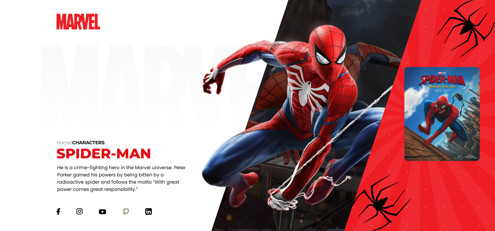
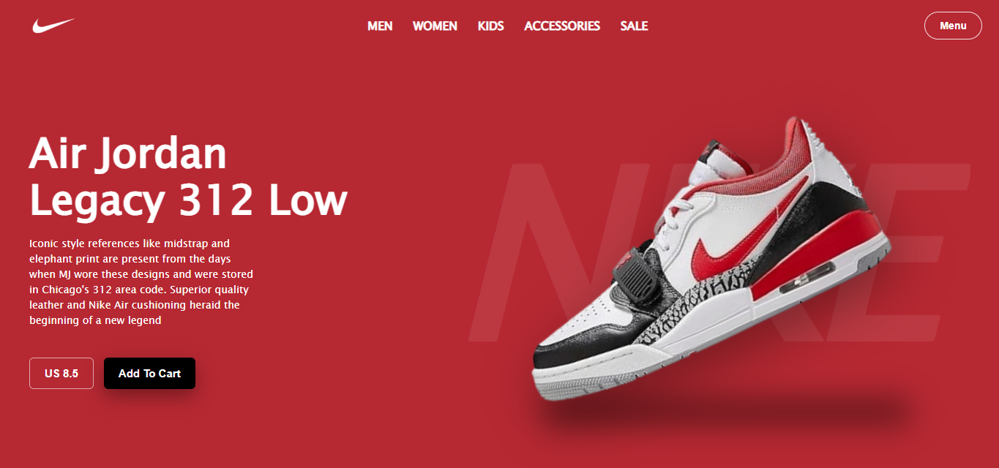

# CreativeLayouts 🎨

### A collection of UI designs built in **HTML, CSS, and JavaScript**.

This repository contains multiple front-end projects showcasing beautiful UI designs.
⚠️ Note: These designs are not fully responsive yet, but I’ll continue improving them over time.

---

## ✨ Features

### 🖥️ Projects

- ⚡ Self-contained HTML/CSS/JS projects
- 🎨 Designs closely follow original Figma layouts
- ✨ Optional interactive elements via JavaScript
- 🔹 Each project includes its own assets folder

### ⚠️ Limitations

- 📱 Not responsive yet
- 📝 Static content — no backend integration
- 🌀 Some layouts may require further UI refinements

---

## 🛠️ Tech Stack

- **Frontend:** HTML5, CSS3, JavaScript
- **Layout & Styling:** Flexbox, CSS Grid, animations
- **Optional:** Small JS interactions

---

## ⚡ How to Run Projects

### Clone repo

```bash
git clone https://github.com/amjadimdad00/CreativeLayouts
cd CreativeLayouts
```

## Open a project

- Navigate to the desired project folder, e.g. `projects/project01/`
- Open index.html in your browser
- Tip: Use VSCode Live Server for live reload and smoother testing

> All project assets (images, fonts, icons) are inside each project’s assets/ folder.

---

## 🛠️ Next Steps

- 📱 Make all layouts fully responsive
- ⚡ Add more Figma designs and HTML/CSS implementations
- ✨ Include small animations and interactive effects
- 🌐 Explore dark mode versions for select projects

---

## ⚡ Preview Gallery

Here’s a small preview of the projects in this repo:




---

## 📜 License

This project is licensed under the [MIT LICENSE](LICENSE).
Feel free to use, modify, and share with attribution.

<p align="center"> Made with 💖 by <a href="https://amjadimdad00.vercel.app" target="_blank"><b>Amjad Imdad</b></a><br> ✨ Star this repo if you found it useful! ✨<br> <sub>Contributions, feedback & PRs are always welcome 🚀</sub> </p>
